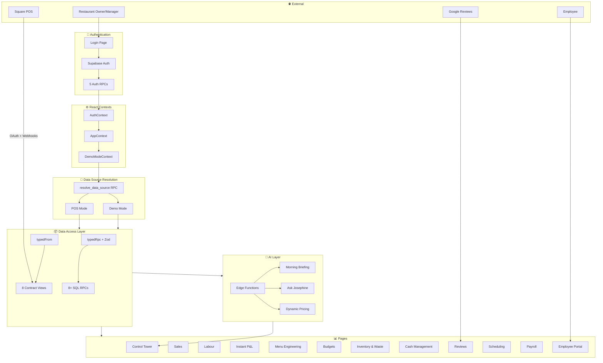
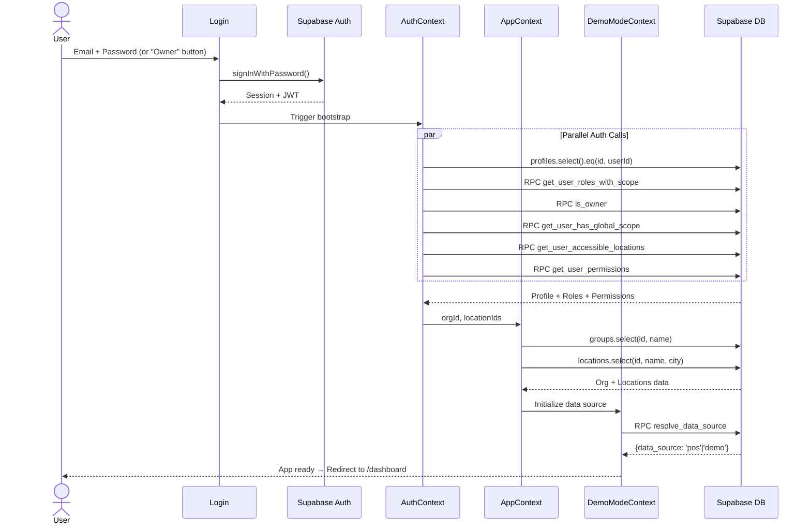
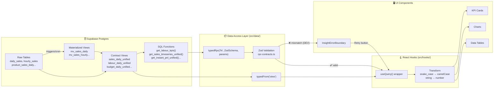
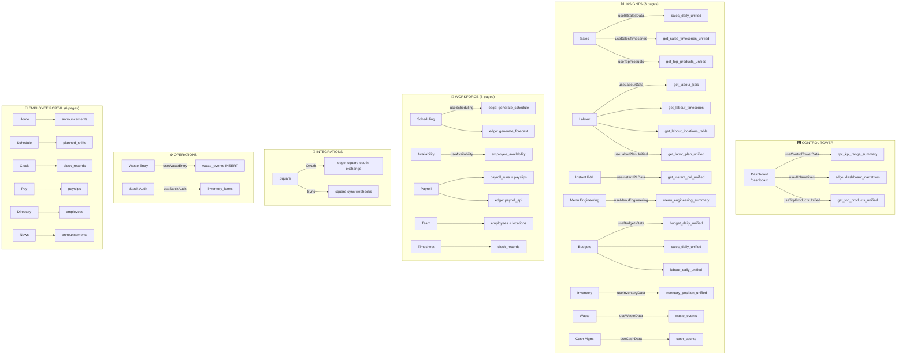
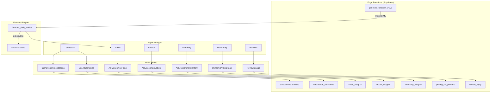
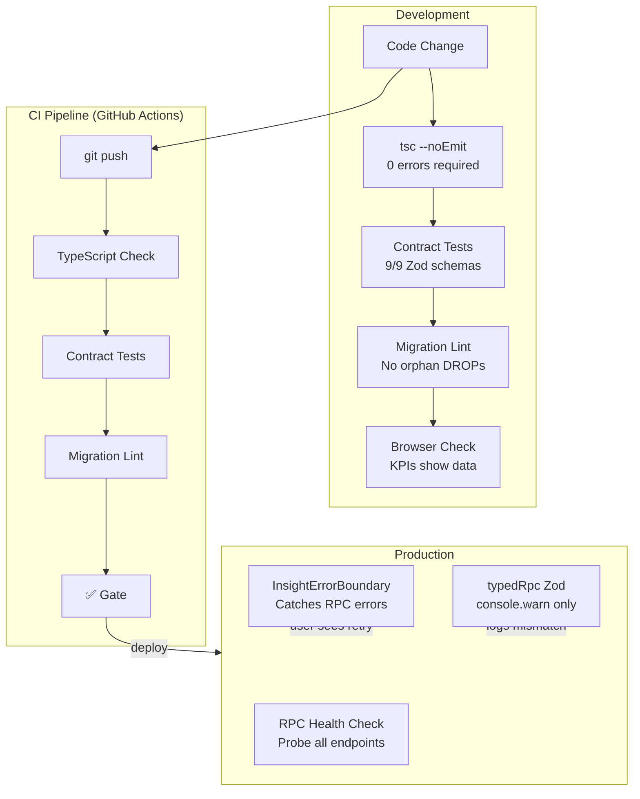

# Josephine — Complete App Flowchart

> A-to-Z visual map of the entire system.

---

## 1. The Big Picture

---

## 2. Auth & Bootstrap Flow

### 🔴 Weak Points Found
- **6 sequential+parallel DB calls** before the app is usable
- If any RPCs like `get_user_roles_with_scope` changes, user gets locked out
- `groups` table name mismatch documented in `DB_APP_CONTRACT.md`

---

## 3. Data Pipeline (per Insight page)

---

## 4. All Pages & Their Data Dependencies

---

## 5. AI Features Map

---

## 6. Safety Net Architecture

---

## 7. 🔴 Weak Points & Improvement Areas

| # | Area | Issue | Impact | Fix Difficulty |
|---|------|-------|--------|---------------|
| 1 | **Auth Bootstrap** | 6 DB calls before app loads | Slow first load (~2s) | 🟡 Medium — combine into 1 RPC |
| 2 | **Forecast Engine** | Edge Functions call external Prophet API | Single point of failure | 🔴 Hard — needs fallback |
| 3 | **Payroll tables** | Not in generated Supabase types | `as any` casts remaining | 🟢 Easy — run `db:types` |
| 4 | **Square integration** | Only Square supported | Limits market reach | 🟡 Medium — need adapter pattern |
| 5 | **Realtime** | Only 2 tables subscribed | Other data can go stale | 🟢 Easy — add more subscriptions |
| 6 | **Caching** | 5min staleTime for all queries | Same for fast/slow data | 🟢 Easy — per-query staleTime |
| 7 | **Error boundaries** | Only on Insight pages | Workforce pages can crash | 🟢 Easy — wrap more routes |
| 8 | **Offline** | No offline support | App fails without network | 🔴 Hard — needs service worker |
| 9 | **Employee portal** | 6 pages, minimal features | Low employee adoption | 🟡 Medium — needs chat, docs |
| 10 | **i18n** | Spanish only (mostly) | Limits international market | 🟡 Medium — already has es.json |
| 11 | **Mobile** | Responsive but not native | Sub-optimal mobile UX | 🟡 Medium — Capacitor exists |
| 12 | **Testing** | Only contract tests | No E2E, no component tests | 🟡 Medium — add Playwright |
