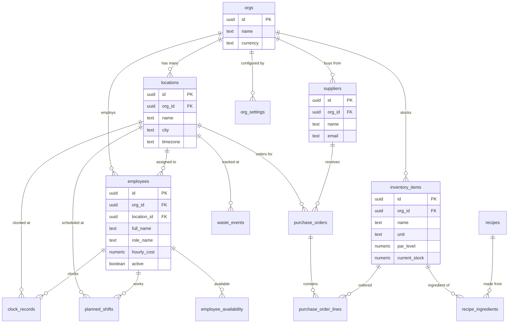
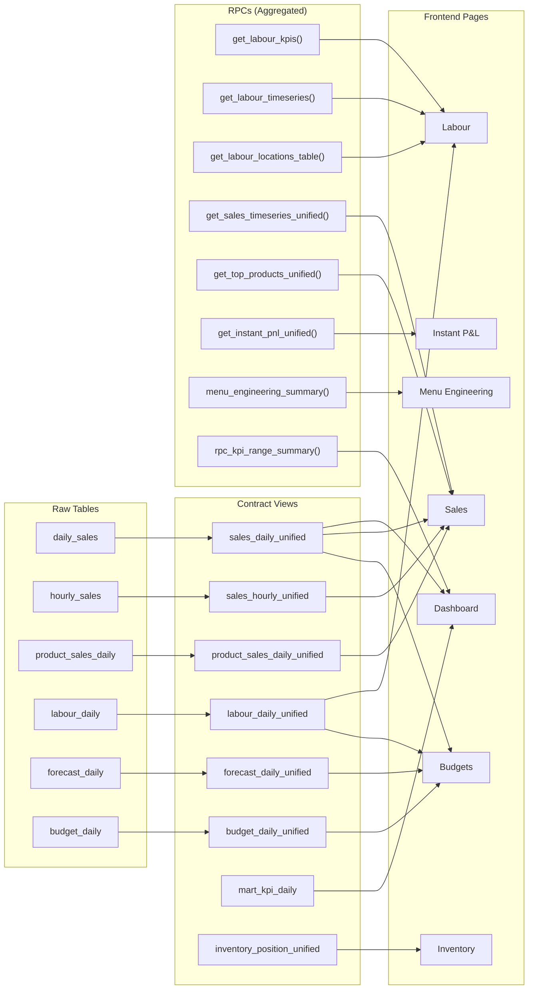

# Entity Relationship Diagram

> Visual map of Josephine's database schema — tables, views, and RPCs.

## Core Entities

## Data Pipeline: Views & RPCs

## RPCs: Parameters & Return Shapes

| RPC | Parameters | Returns | DAL File |
|-----|-----------|---------|----------|
| `get_labour_kpis` | `date_from`, `date_to`, `selected_location_id`, `p_data_source` | Sales, COL%, SPLH, OPLH, prime cost | `labour.ts` |
| `get_labour_timeseries` | same | Daily breakdown of above | `labour.ts` |
| `get_labour_locations_table` | same | Per-location comparison | `labour.ts` |
| `get_sales_timeseries_unified` | `p_org_id`, `p_location_ids`, `p_from`, `p_to` | Daily sales timeseries | `sales.ts` |
| `get_top_products_unified` | same + `p_limit` | Top products by revenue | `sales.ts` |
| `get_instant_pnl_unified` | `p_org_id`, `p_location_ids`, `p_from`, `p_to` | P&L snapshot | `sales.ts` |
| `menu_engineering_summary` | `p_date_from`, `p_date_to`, `p_location_id`, `p_data_source` | Star/Horse/Puzzle/Dog matrix | `sales.ts` |
| `rpc_kpi_range_summary` | `p_org_id`, `p_from`, `p_to` | Nested summary for Control Tower | `kpi.ts` |

## Views: Column Reference

| View | Key Columns | Used By |
|------|------------|---------|
| `sales_daily_unified` | org_id, location_id, day, net_sales, orders_count, avg_check, labor_cost | Sales, Dashboard, Budget |
| `sales_hourly_unified` | org_id, location_id, day, hour_of_day, net_sales, orders_count | Sales (hourly mode) |
| `product_sales_daily_unified` | product_name, product_category, units_sold, net_sales, cogs, margin_pct | Sales (products) |
| `labour_daily_unified` | org_id, location_id, day, actual_hours, actual_cost, scheduled_hours | Budget |
| `forecast_daily_unified` | forecast_sales, forecast_orders, planned_labor_hours | Forecast, Budget |
| `budget_daily_unified` | budget_sales, budget_labour, budget_cogs, budget_profit | Budgets |
| `mart_kpi_daily` | net_sales, orders_count, covers, avg_check, labour_cost | Dashboard |
| `inventory_position_unified` | item_id, name, on_hand, par_level, deficit | Inventory |
